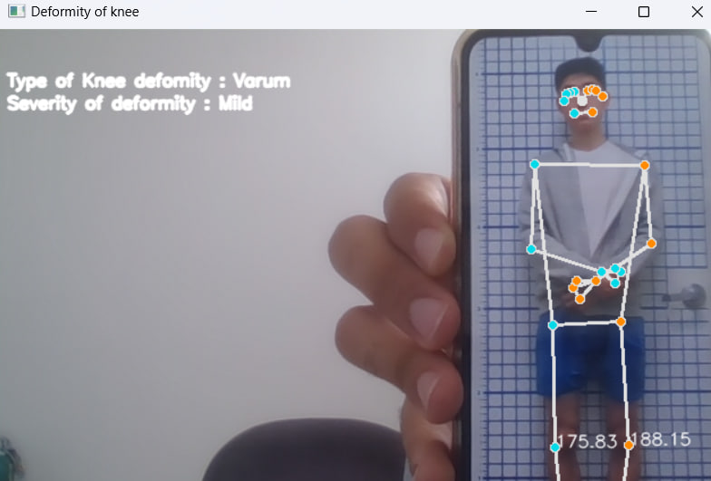
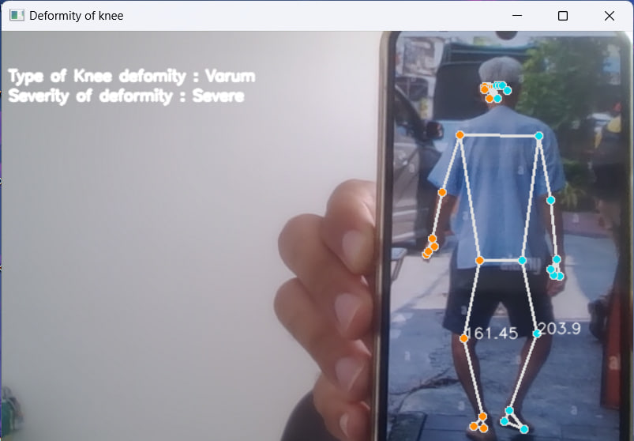
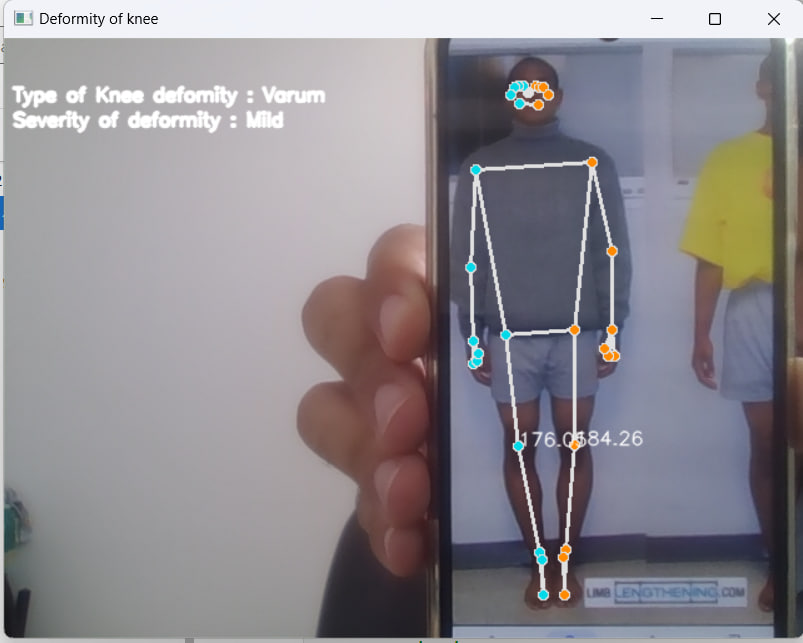

# 🦵 Genu Valgum/Varum Detection using MediaPipe & OpenCV

- Genu Valgum 
- Genu Varum 
- Normal 

---

## 📌 Libraries

 - **MediaPipe** 
 - **OpenCV** 
 - **NumPy** 

## Detecting Severity

- Mild
- Moderate
- Severe 

Based on medical papers like : https://durham-repository.worktribe.com/OutputFile/1262717?utm_source

## 🟢 Result

  

  

  

